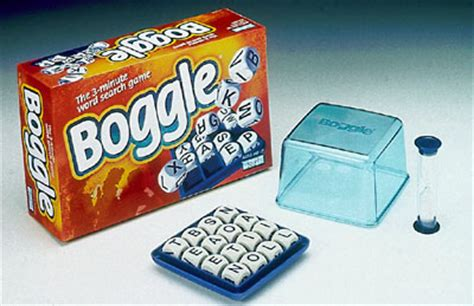

#Boggle



## Overview

Boggle is a word game designed by Bill Cooke, invented by Allan Turoff and originally distributed by Parker Brothers. The game is played using a plastic grid of lettered dice, in which players attempt to find words in sequences of adjacent letters.

## Implementation

This version of boggle is written in Python. The program generates a random grid of letters and then finds all valid words in the grid based on a provided word list.

## Limitations

There are some limitations in the code as it currently stands.

* The letters in the grid are completely random. There are no guarantees of vowels, or the distribution of letters.

* Q and U are separate letters, there is no support for Qu

* There is no support for command line arguments to allow grid size or word list to be specified when running the program.

* There is a 3d version of the code which uses a cube of letters rather than a grid. This duplicates most of the code from the 2d version.

## Installation

Just clone this repository.

```bash
$ git clone https://github.com/richardadalton/boggle.git
```

## Running Boggle

There are 2D (grid) and 3D (cube) versions of boggle. To run the grid version run boggle.py.

```bash
$ python boggle.py
```

To run the cube version, run boggle3d.py

```bash
$ python boggle3d.py
```